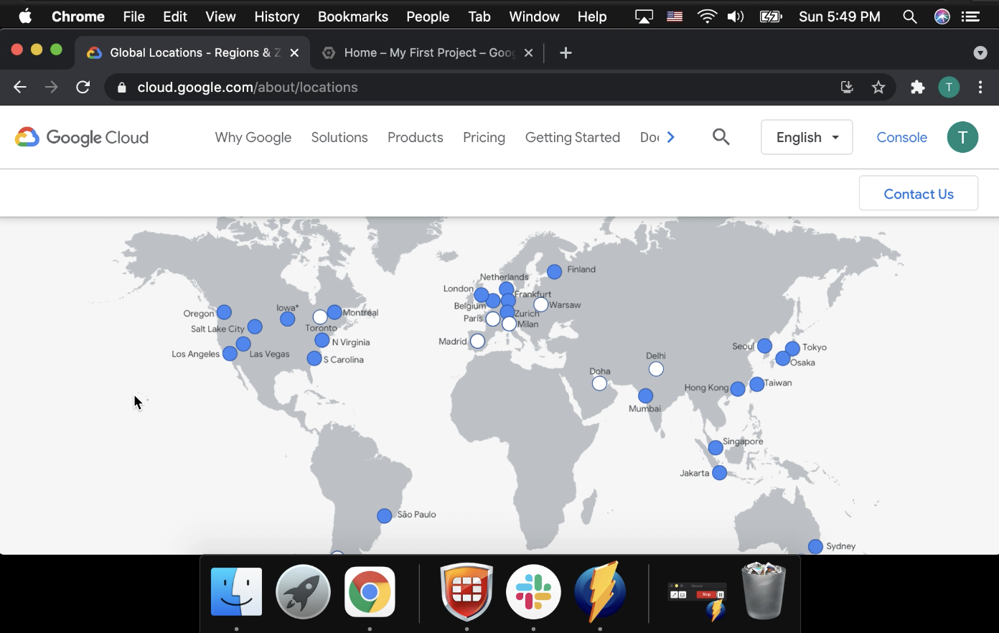

# Creating Projects

## Resources

> Google Cloud consists of a set of physical assets, such as computers and hard disk drives, and virtual resources, such as virtual machines (VMs), that are contained in Google's data centers around the globe. Each data center location is in a region. Regions are available in Asia, Australia, Europe, North America, and South America. Each region is a collection of zones, which are isolated from each other within the region. Each zone is identified by a name that combines a letter identifier with the name of the region. For example, zone a in the East Asia region is named asia-east1-a.

[Google Cloud overview](https://cloud.google.com/docs/overview)

[Google Data Center Search](https://www.google.com/search?q=google+data+center&tbm=isch&ved=2ahUKEwiexf7EgsLvAhVhIn0KHVSRBq0Q2-cCegQIABAA&oq=google+data+center&gs_lcp=CgNpbWcQA1AAWABgopgcaABwAHgAgAEAiAEAkgEAmAEAqgELZ3dzLXdpei1pbWc&sclient=img&ei=BZFXYN6uNOHE9APUoproCg&bih=868&biw=1680)

[Cloud Locations](https://cloud.google.com/about/locations)

> Some resources can be accessed by any other resource, across regions and zones. These global resources include preconfigured disk images, disk snapshots, and networks. Some resources can be accessed only by resources that are located in the same region. These regional resources include static external IP addresses. Other resources can be accessed only by resources that are located in the same zone. These zonal resources include VM instances, their types, and disks.

[Google Cloud overview](https://cloud.google.com/docs/overview)

## Projects

> Any Google Cloud resources that you allocate and use must belong to a project. You can think of a project as the organizing entity for what you're building. A project is made up of the settings, permissions, and other metadata that describe your applications. Resources within a single project can work together easily, for example by communicating through an internal network, subject to the regions-and-zones rules.

[Google Cloud overview](https://cloud.google.com/docs/overview)

## Create a Project

> Project name: A human-readable name for your project.
> 
> The project name isn't used by any Google APIs. You can edit the project name at any time during or after project creation. Project names do not need to be unique.
> 
> Project ID: A customizable unique identifier for your project.
> 
> The project ID is a unique, user-assigned ID that can be used by Google APIs. If you do not specify a project ID during project creation, a project ID will be generated automatically.
> 
> The project ID must be a unique string of 6 to 30 lowercase letters, digits, or hyphens. It must start with a letter, and cannot have a trailing hyphen. You cannot change a project ID once it has been created. You cannot re-use a project ID that is in use, or one that has been used for a deleted project.
> 
> Some words are restricted from use in project IDs. If you use restricted words in the project name, such as google or ssl, the generated project ID will not include these words.
> 
> Project number: An automatically generated unique identifier for your project.

[Creating and Managing Projects](https://cloud.google.com/resource-manager/docs/creating-managing-projects)

## Listing Projects

> You can list all projects you have access to using the Cloud Console or the projects.list() method.

[Creating and Managing Projects](https://cloud.google.com/resource-manager/docs/creating-managing-projects)

## Delete a Project

> This method immediately marks a project to be deleted. A project that is marked for deletion is not usable. If the project has a billing account associated with it, that association is broken, and will not be reinstated even if the project delete operation is immediately canceled. After approximately 30 days, the project will be fully deleted.

[Creating and Managing Projects](https://cloud.google.com/resource-manager/docs/creating-managing-projects)

> At the end of the 30-day period, the project and all of its resources are deleted and cannot be recovered. Until it is deleted, the project will count towards your project quota.
> 
> If you have set up billing for a project, it might not be completely deleted until the current billing cycle ends and your account is successfully charged.

[Creating and Managing Projects](https://cloud.google.com/resource-manager/docs/creating-managing-projects)
