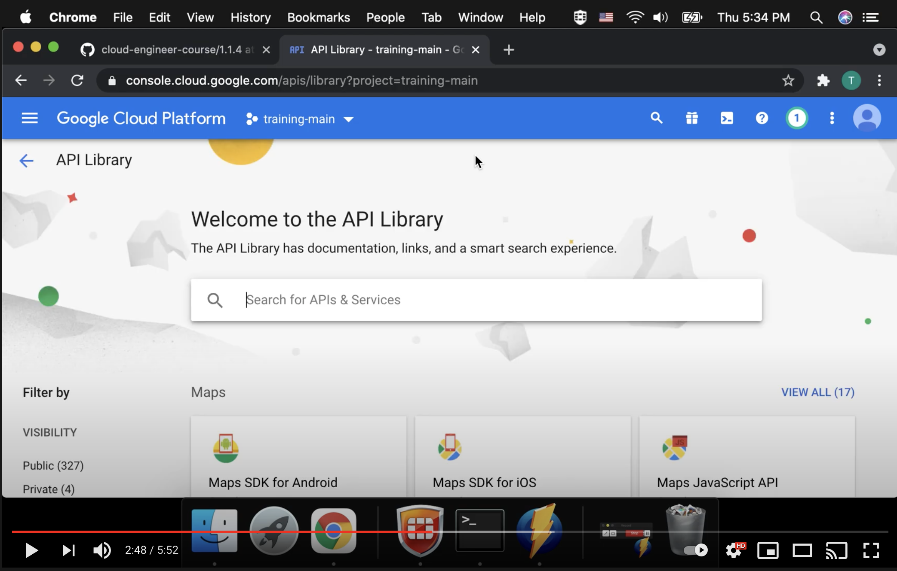

# Enabling APIs within projects

> Google Cloud APIs are programmatic interfaces to Google Cloud Platform services. They are a key part of Google Cloud Platform, allowing you to easily add the power of everything from computing to networking to storage to machine-learning-based data analysis to your applications.

[Google Cloud APIs](https://cloud.google.com/apis/docs/overview)

> Cloud APIs are implemented as network API services, such as Cloud Pub/Sub API. Each Cloud API typically runs on one or more subdomains of googleapis.com, such as pubsub.googleapis.com, and provides both JSON HTTP and gRPC interfaces to clients over public internet and virtual private cloud (VPC) networks. Clients can send HTTP and gRPC requests directly to Cloud API endpoints or by using client libraries.

[Google Cloud APIs](https://cloud.google.com/apis/docs/overview)

> The Google Cloud Console provides a web-based, graphical user interface that you can use to manage your Google Cloud projects and resources. 

[Google Cloud overview](https://cloud.google.com/docs/overview)

> If you prefer to work at the command line, you can perform most Google Cloud tasks by using the gcloud command-line tool. The gcloud tool lets you manage development workflow and Google Cloud resources in a terminal window.

[Google Cloud overview](https://cloud.google.com/docs/overview)

> The Cloud SDK includes client libraries that enable you to easily create and manage resources.

[Google Cloud overview](https://cloud.google.com/docs/overview)

> When you create a Cloud project using the Cloud Console or Cloud SDK, the following APIs and services are enabled by default:
>
> Note: You can disable any of the following services, just like any other service you enable.

[Enabled Services](https://cloud.google.com/service-usage/docs/enabled-service)

> Some APIs and services are automatically enabled when you use them in Cloud Console. For example, if you visit the Compute Engine page, the Compute Engine API is automatically enabled.

[Enabled Services](https://cloud.google.com/service-usage/docs/enabled-service)
