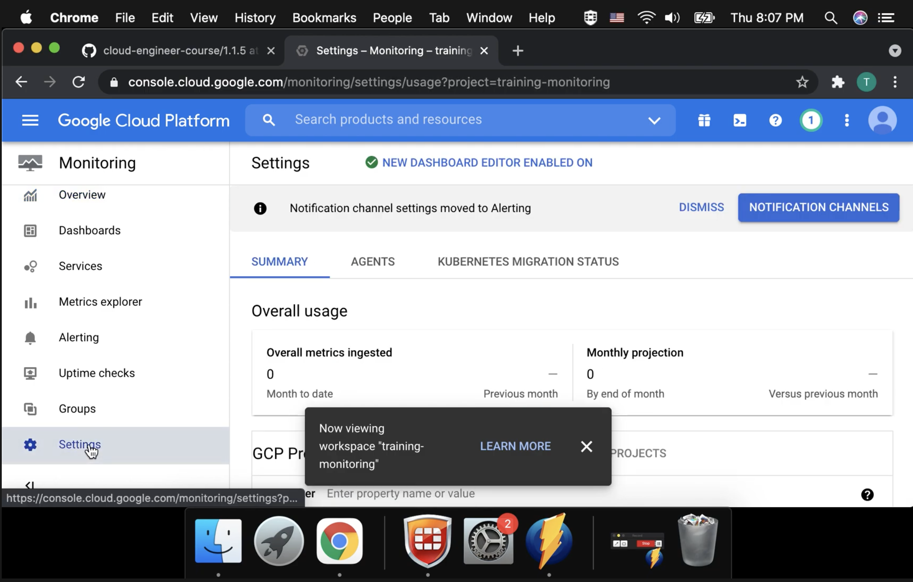

# Provisioning one or more Stackdriver workspaces

**Addendum 2022-02-11**

In the video, we were able to easily add additional Projects to the Workspace because we had the *Owner* Role in those Projects. Here we explore what more narrow Role we would need to accomplish this.

> By default, a Google Cloud project has visibility only to the metrics it stores. However, you can expand the set of metrics that a project can access by adding other Google Cloud projects to the project's metrics scope. The metrics scope defines the set of Google Cloud projects whose metrics the current Google Cloud project can access.

> We recommend that you use a new Cloud project or one without resources as the scoping project when you want to view metrics for multiple Cloud projects or AWS accounts.

[Overview of viewing metrics for multiple projects](https://cloud.google.com/monitoring/settings)

> Ensure that your Identity and Access Management (IAM) roles on the scoping project, and on each project that you want to add as a monitored project, include the metricsScopesAdmin role. For more information, see Metrics scope configurations.

[View metrics for multiple Cloud projects](https://cloud.google.com/monitoring/settings/multiple-projects)

**Notes**

> Cloud Monitoring collects metrics, events, and metadata from Google Cloud, Amazon Web Services (AWS), hosted uptime probes, and application instrumentation. Using the BindPlane service, you can also collect this data from over 150 common application components, on-premise systems, and hybrid cloud systems. Google Cloud's operations suite ingests that data and generates insights via dashboards, charts, and alerts. BindPlane is included with your Google Cloud project at no additional cost.

[Cloud Monitoring Documentation](https://cloud.google.com/monitoring/docs)

> A Workspace is a tool for monitoring resources contained in one or more Google Cloud projects or AWS accounts. A Workspace accesses metric data from its monitored projects, but the metric data remains in those projects.

[Workspaces](https://cloud.google.com/monitoring/workspaces)

> Every Workspace has a host project. The host project is the Google Cloud project used to create the Workspace. The name of the Workspace is set to the name of host project. This isn't configurable.

[Workspaces](https://cloud.google.com/monitoring/workspaces)

> A Google Cloud project or AWS account can be monitored by exactly 1 Workspace. A Workspace always monitors its Google Cloud host project. However, you can configure a Workspace to monitor up to 375 Google Cloud projects and AWS accounts.

[Workspaces](https://cloud.google.com/monitoring/workspaces)

> If you plan to use a Workspace to monitor more than the host project, then the best practice is to use a new, empty Google Cloud project to host the Workspace and then to add the projects and AWS accounts you want to monitor to your Workspace.

[Workspaces](https://cloud.google.com/monitoring/workspaces)
