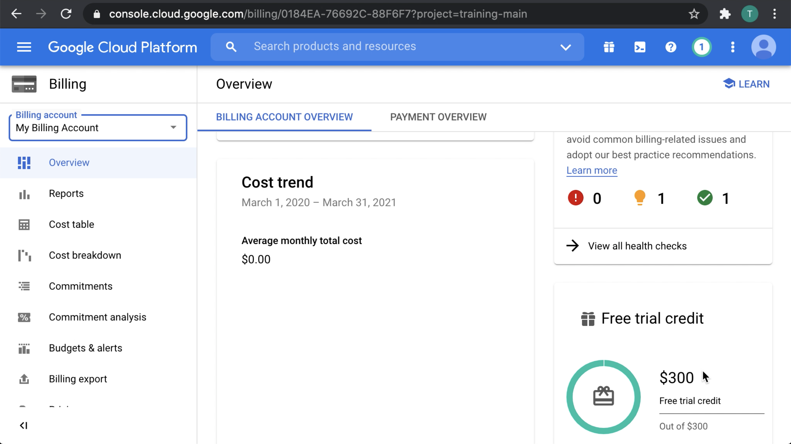

# Creating one or more billing accounts

> A Cloud Billing account is set up in Google Cloud and is used to define who pays for a given set of Google Cloud resources and Google Maps Platform APIs. Access control to a Cloud Billing account is established by IAM roles. A Cloud Billing account is connected to a Google payments profile. Your Google payments profile includes a payment instrument to which costs are charged.
>
> Is a cloud-level resource managed in the Cloud Console.
>
> Tracks all of the costs (charges and usage credits) incurred by your Google Cloud usage
>
> A Cloud Billing account can be linked to one or more projects.
>
> Project usage is charged to the linked Cloud Billing account.
>
> Results in a single invoice per Cloud Billing account
>
> Operates in a single currency
>
> Defines who pays for a given set of resources
>
> Is connected to a Google Payments Profile, which includes a payment instrument, defining how you pay for your charges
Has billing-specific roles and permissions to control accessing and modifying billing-related functions (established by IAM roles)

[Overview of Cloud Billing concepts](https://cloud.google.com/billing/docs/concepts)

> To stop automatic payments for a project, you can disable billing for the project. You are still responsible for all outstanding charges for the project. Your listed form of payment on your Cloud Billing account will be used to pay for any outstanding charges.
> 
> Caution: If you disable billing for a project, some of your Google Cloud resources might be removed and become non-recoverable. Instead, consider shutting down your project. Shutting down a project releases all resources used within the project. Only project owners can shut down or restore projects.

[Enable, disable, or change billing for a project](https://cloud.google.com/billing/docs/how-to/modify-project)

> To grant or limit access to Cloud Billing, you can set an IAM policy at the organization level, the Cloud Billing account level, and/or the project level. Google Cloud resources inherit the IAM policies of their parent node, which means you can set a policy at the organization level to apply it to all the Cloud Billing accounts, projects, and resources in the organization.

[Overview of Cloud Billing access control](https://cloud.google.com/billing/docs/how-to/billing-access)

> Billing Account Administrator (roles/billing.admin)
> 
> This role is an owner role for a billing account. Use it to manage payment instruments, configure billing exports, view cost information, link and unlink projects and manage other user roles on the billing account.
>
> Billing Account User (roles/billing.user)
> 
> This role has very restricted permissions, so you can grant it broadly, typically in combination with Project Creator. These two roles allow a user to create new projects linked to the billing account on which the role is granted.

[Overview of Cloud Billing access control](https://cloud.google.com/billing/docs/how-to/billing-access)
