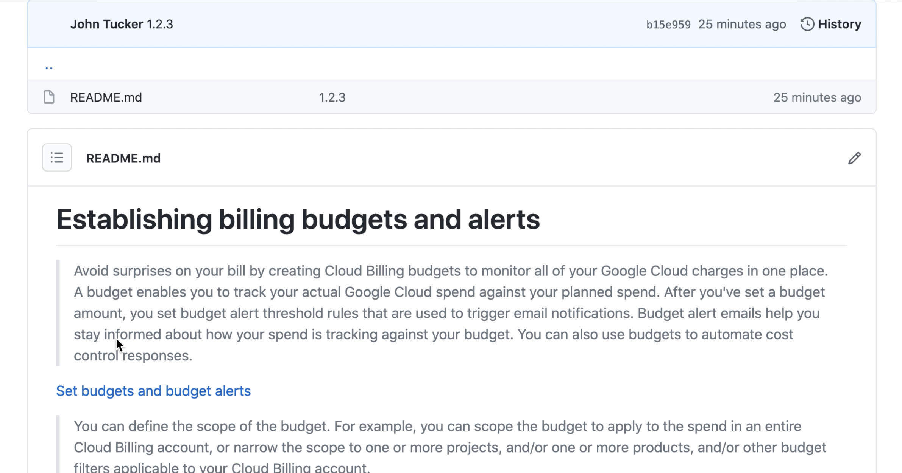

# Establishing billing budgets and alerts

> Avoid surprises on your bill by creating Cloud Billing budgets to monitor all of your Google Cloud charges in one place. A budget enables you to track your actual Google Cloud spend against your planned spend. After you've set a budget amount, you set budget alert threshold rules that are used to trigger email notifications. Budget alert emails help you stay informed about how your spend is tracking against your budget. You can also use budgets to automate cost control responses.

[Set budgets and budget alerts](https://cloud.google.com/billing/docs/how-to/budgets)

> You can define the scope of the budget. For example, you can scope the budget to apply to the spend in an entire Cloud Billing account, or narrow the scope to one or more projects, and/or one or more products, and/or other budget filters applicable to your Cloud Billing account.
>
> You can set the budget amount to a total that you specify, or base the budget amount on the previous month's spend.
>
> You can set threshold rules to trigger email alert notifications. When your costs (actual costs or forecasted costs) exceed a percentage of your budget (based on the rules you set), alert emails are sent to the recipients you specify.

[Set budgets and budget alerts](https://cloud.google.com/billing/docs/how-to/budgets)

## Setting up billing exports to estimate daily/monthly charges

> Cloud Billing export to BigQuery enables you to export detailed Google Cloud billing data (such as usage, cost estimates, and pricing data) automatically throughout the day to a BigQuery dataset that you specify. Then you can access your Cloud Billing data from BigQuery for detailed analysis, or use a tool like Google Data Studio to visualize your data. You can also use this export method to export data to a JSON file.

[Export Cloud Billing data to BigQuery](https://cloud.google.com/billing/docs/how-to/export-data-bigquery)
