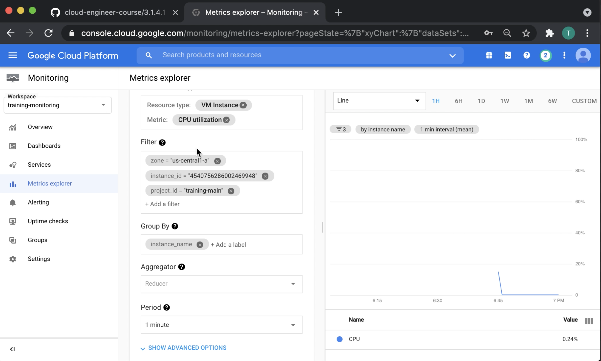

# Configuring a VM for Stackdriver monitoring and logging (Part 1)

## Cloud Monitoring Concepts

> Cloud Monitoring collects measurements to help you understand how your applications and system services are performing. A collection of these measurements is generically called a metric. The applications and system services being monitored are called monitored resources.

[Metrics, time series, and resources](https://cloud.google.com/monitoring/api/v3/metrics)

> A metric is a set of related measurements of some attribute of a resource you are monitoring. Measurements might include the latency of requests to a service, the amount of disk space available on a machine, the number of tables in your SQL database, the number of widgets sold, and so forth. Resources might include virtual machines (VMs), database instances, disks, and so forth.

[Metrics, time series, and resources](https://cloud.google.com/monitoring/api/v3/metrics)

## Under the Hood

> In Cloud Monitoring, the data structure that underlies this model is the time series (the singular and the plural forms are the same).
>
> Each time series encompasses the three components of the model:
> 
> A description of the monitored resource from which the data originated.
>
> The set of time-stamped values associated with a single monitored resource.
>
> A description of the metric type that describes what you are measuring.

[Metrics, time series, and resources](https://cloud.google.com/monitoring/api/v3/metrics)

> gce_instance
>
> Display name: VM Instance
>
> Description: A virtual machine instance hosted in Compute Engine.
>
> Labels:
>
> project_id: The identifier of the GCP project associated with this resource, such as "my-project".
>
> instance_id: The numeric VM instance identifier assigned by Compute Engine.
>
> zone: The Compute Engine zone in which the VM is running.

[Monitored resource types](https://cloud.google.com/monitoring/api/resources#tag_gce_instance)

> instance/cpu/utilization GA
>
> CPU utilization
>
> GAUGE, DOUBLE, 10^2.%
>
> gce_instance
>
> Labels:
>
> instance_name
>
> Fractional utilization of allocated CPU on this instance. Values are typically numbers between 0.0 and 1.0 (but some machine types allow bursting above 1.0). Charts display the values as a percentage between 0% and 100% (or more). This metric is reported by the hypervisor for the VM and can differ from `agent.googleapis.com/cpu/utilization`, which is reported from inside the VM. Sampled every 60 seconds. After sampling, data is not visible for up to 240 seconds.

[Google Cloud metrics](https://cloud.google.com/monitoring/api/metrics_gcp)

## Metric Type and Kind

> For measurements consisting of a single value at a time, like boolean values and numeric data, the value type tells you how the data is stored:
>
> BOOL, a boolean
>
> INT64, a 64-bit integer
>
> DOUBLE, a double-precision float
>
> STRING, a string

[Value types and metric kinds](https://cloud.google.com/monitoring/api/v3/kinds-and-types)

> A gauge metric, in which the value measures a specific instant in time. For example, metrics measuring CPU utilization are gauge metrics; each point records the CPU utilization at the time of measurement. Another example of a gauge metric is the current temperature.
>
> A delta metric, in which the value measures the change since it was last recorded. For example, metrics measuring request counts are delta metrics; each value records how many requests were received since the last data point was recorded.
>
> A cumulative metric, in which the value constantly increases over time. For example, a metric for “sent bytes” might be cumulative; each value records the total number of bytes sent by a service at that time.

[Value types and metric kinds](https://cloud.google.com/monitoring/api/v3/kinds-and-types)

## Dashboards

> Dashboards are one way for you to view and analyze metric data that is important to you.
Cloud Monitoring provides predefined dashboards for the Google Cloud services that you use. These dashboards require no setup or configuration effort.
>
> You can also create custom dashboards that display the content you select. When designing a custom dashboard, you have the option to start with an empty dashboard and add just those widgets of interest to you, or you can install a dashboard configuration that is stored in GitHub and then modify that configuration to meet your needs. You can create custom dashboards by using the Google Cloud Console or by using the Dashboard endpoint in the Cloud Monitoring API.

[Using dashboards and charts](https://cloud.google.com/monitoring/dashboards)
