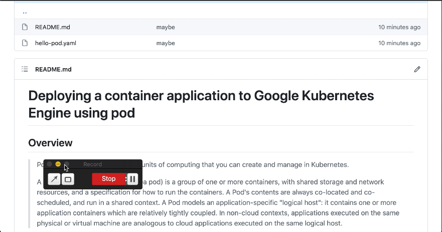

# Deploying a container application to Google Kubernetes Engine using pod

[](https://youtu.be/a_bysLlrrQY)

## Overview

> Pods are the smallest deployable units of computing that you can create and manage in Kubernetes.
>
> A Pod (as in a pod of whales or pea pod) is a group of one or more containers, with shared storage and network resources, and a specification for how to run the containers. A Pod's contents are always co-located and co-scheduled, and run in a shared context. A Pod models an application-specific "logical host": it contains one or more application containers which are relatively tightly coupled. In non-cloud contexts, applications executed on the same physical or virtual machine are analogous to cloud applications executed on the same logical host.

[Pods](https://kubernetes.io/docs/concepts/workloads/pods/)

```
kubectl apply -f hello-pod.yaml
```

```
kubectl get pods
```

```
kubectl describe pod hello
```

```
kubectl describe node XXX
```

```
kubect exec hello -it -- /bin/bash
```

```
kubectl delete pod hello
```
