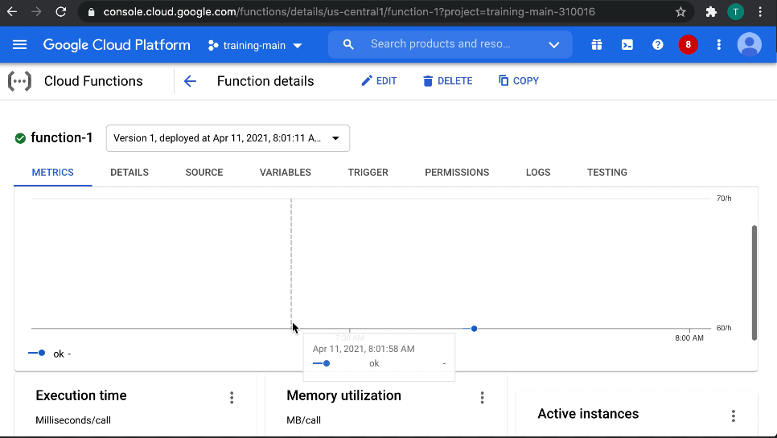

# Deploying an application, updating scaling configuration, versions, and traffic splitting (Cloud Functions)

> Scalable pay-as-you-go functions as a service (FaaS) to run your code with zero server management.

[Cloud Functions](https://cloud.google.com/functions)

> Invocations are charged at a per-unit rate of $0.0000004 per invocation, excluding the first 2 million free invocations per month and are charged regardless of the outcome of the function or its duration.
> 
> Fees for compute time are variable based on the amount of memory and CPU provisioned for the function.

[Pricing](https://cloud.google.com/functions/pricing)

> To handle HTTP, Cloud Functions uses a particular HTTP framework version in each runtime:
>
> Node.js (8, 10 & 12)	Express 4.17.1

[HTTP Functions](https://cloud.google.com/functions/docs/writing/http)

## Logs

> You can also view runtime logs for Cloud Functions from the Cloud Console.

[Writing, Viewing, and Responding to Logs](https://cloud.google.com/functions/docs/monitoring/logging)

## Scaling Configuration

> Max instances in Cloud Functions is a feature that allows you to limit the degree to which your function will scale in response to incoming requests.
>
> In Cloud Functions, scaling is achieved by creating new instances of your function. Each of these instances can only handle one request at a time, so large spikes in request volume might result in creating many instances.

[Controlling Scaling Behavior](https://cloud.google.com/functions/docs/max-instances)

> To minimize the impact of cold starts, Cloud Functions will often maintain a reserve of idle instances for your function. These instances are ready to handle requests in case of a sudden traffic spike.

[Controlling Scaling Behavior](https://cloud.google.com/functions/docs/max-instances)

## Traffic Splitting

N/A
