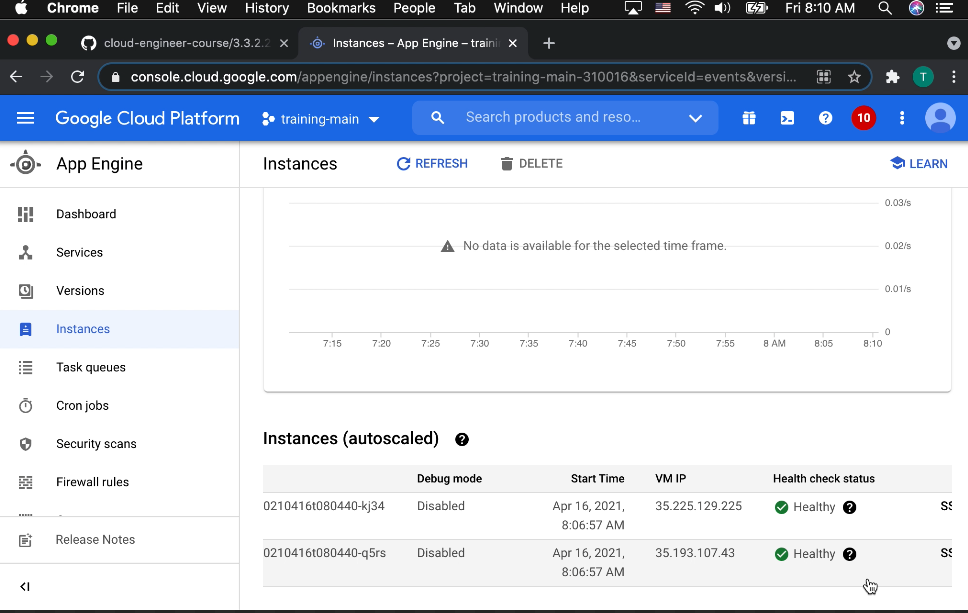

# Deploying an application that receives Google Cloud events (e.g., Cloud Pub/Sub events, Cloud Storage object change notification events) (App Engine - Flexible Environment)

[](https://youtu.be/CBHsMP_S3Zk)

> A service account is a special kind of account used by an application or a virtual machine (VM) instance, not a person. Applications use service accounts to make authorized API calls, authorized as either the service account itself, or as Google Workspace or Cloud Identity users through domain-wide delegation.

[Service accounts](https://cloud.google.com/iam/docs/service-accounts)

> After you create an App Engine application, the App Engine default service account is created and used as the identity of the App Engine service. The App Engine default service account is associated with your Cloud project and executes tasks on behalf of your apps running in App Engine.
> 
> By default, the App Engine default service account has the Editor role in the project. This means that any user account with sufficient permissions to deploy changes to the Cloud project can also run code with read/write access to all resources within that project.

[Using the Default App Engine Service Account](https://cloud.google.com/appengine/docs/standard/nodejs/service-account)

```
gcloud app deploy
```
