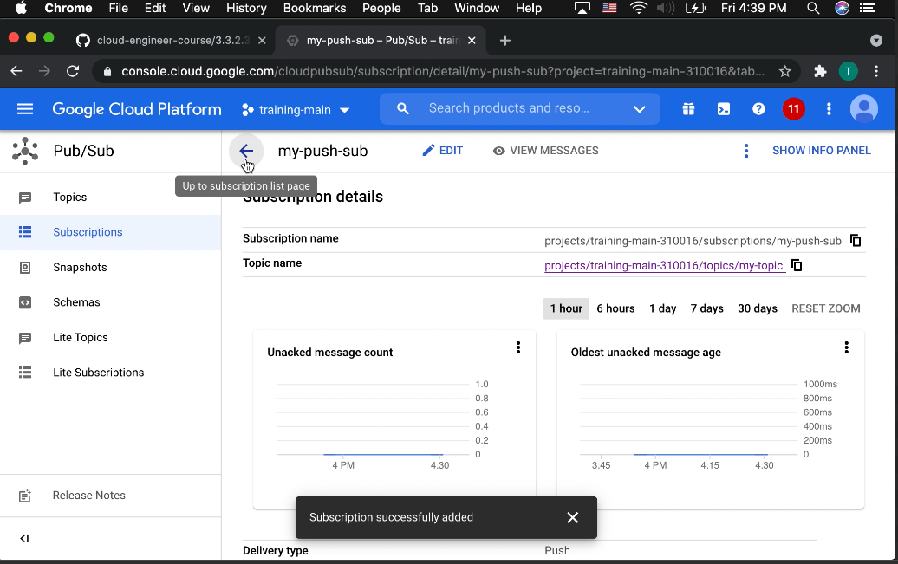

# Deploying an application that receives Google Cloud events (e.g., Cloud Pub/Sub events, Cloud Storage object change notification events) (Cloud Run)

## Addendum

In making the video, I neglected to review how scaling factored into using Cloud Run with Cloud Pub / Sub. That being said, there is not much to say as it scaled in the same way any other HTTPS service does in Cloud Run, i.e., by scaling on concurrency (default 80).

While it was not necessary to discuss in this example, it is helpful to know how to run Cloud Run with a service account.

> During its execution, a Cloud Run revision uses a service account as its identity. This means that when your code uses Google Cloud client libraries, it automatically obtains and uses credentials from the runtime service account of the current Cloud Run revision. This strategy is called "Application Default Credentials".
>
> By default, Cloud Run revisions are using the Compute Engine default service account (PROJECT_NUMBER-compute@developer.gserviceaccount.com), which has the Project > Editor IAM role. This means that by default, your Cloud Run revisions have read and write access to all resources in your Google Cloud project. While this is very convenient, we recommend granting more granular permissions to each of your Cloud Run services by assigning dedicated service accounts with more restricted IAM roles.

[Service identity](https://cloud.google.com/run/docs/securing/service-identity)

## Video

[](https://youtu.be/JENm4hUqqzs)

> In push delivery, Pub/Sub initiates requests to your subscriber application to deliver messages.
> 
> The Pub/Sub server sends each message as an HTTPS request to the subscriber application at a pre-configured endpoint.
>
> The endpoint acknowledges the message by returning an HTTP success status code. A non-success response indicates that the message should be resent.

[Subscriber overview](https://cloud.google.com/pubsub/docs/subscriber)

> When Pub/Sub delivers a message to a push endpoint, Pub/Sub sends the message in the body of a POST request. The body of the request is a JSON object and the message data is in the message.data field. The message data is base64-encoded.

[Using push subscriptions](https://cloud.google.com/pubsub/docs/push)

```
gcloud builds submit --tag gcr.io/training-main-310016/events:0.1.0
```

```
gcloud run deploy --image gcr.io/training-main-310016/events:0.1.0 --platform managed
```
