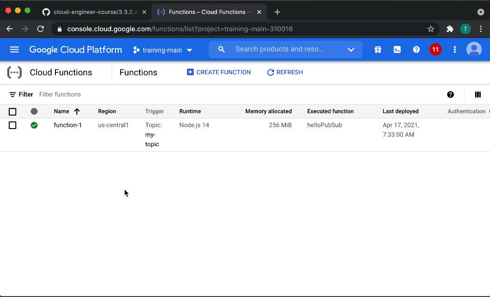

# Deploying an application that receives Google Cloud events (e.g., Cloud Pub/Sub events, Cloud Storage object change notification events) (Cloud Functions)

> Cloud Functions automatically creates push subscriptions that forward messages from the specified topic to your function.

[Cloud Pub/Sub Tutorial](https://cloud.google.com/functions/docs/tutorials/pubsub)

## Sidebar into Identify

> Just as other entities need access to Cloud Functions to interact with it, functions themselves often need access to other resources in Google Cloud to do their work. By default Cloud Functions uses the App Engine default service account - PROJECT_ID@appspot.gserviceaccount.com - as its identity for function execution.
> 
> But the App Engine service account has the Editor role, which lets it access many GCP services. While this is the fastest way to develop functions, it's likely too permissive for what your function needs in production, and you'll want to configure it for least privilege access.

[Function Identity](https://cloud.google.com/functions/docs/securing/function-identity)
