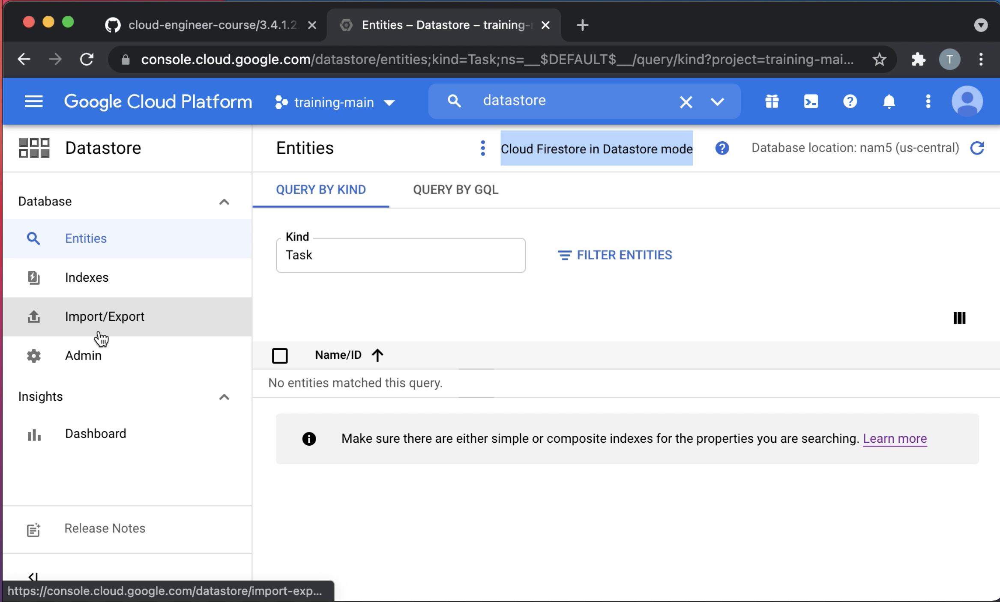
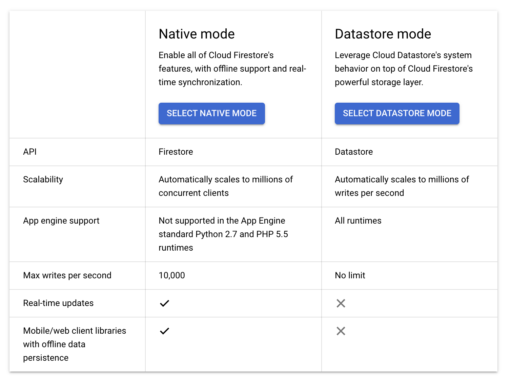

# Initializing data systems with products (Cloud Datastore) (Part 1)

> When you create a new Firestore database, you can configure the database instance to run in Datastore mode which makes the database backwards-compatible with Datastore
> ...
> Firestore is the next major version of Datastore and a re-branding of the product. Taking the best of Datastore and the Firebase Realtime Database, Firestore is a NoSQL document database built for automatic scaling, high performance, and ease of application development.
> ...
> Firestore in Datastore mode uses Datastore system behavior but accesses Firestore's storage layer

[Choosing between Native mode and Datastore mode](https://cloud.google.com/datastore/docs/firestore-or-datastore)

## What is in Common

> When you use Firestore, you are charged for the following:
>
> The number of documents you read, write, and delete.
> The amount of storage that your database uses, including overhead for metadata and indexes.
> The amount of network bandwidth that you use.

[Firestore pricing](https://cloud.google.com/firestore/pricing)

Single database per project; so:

- The mode you select here will be permanent for this project
- your location selection is permanent and will also apply to this project's App Engine app
- choose a regional location (lower write latency, lower cost) or a multi-region location (higher availability, higher cost)

## What is Different

## Firestore in Datastore Mode

> Data objects in Firestore in Datastore mode are known as entities. An entity has one or more named properties, each of which can have one or more values. Entities of the same kind do not need to have the same properties, and an entity's values for a given property do not all need to be of the same data type. (If necessary, an application can establish and enforce such restrictions in its own data model.)
>
> ...
>
> Each entity in a Datastore mode database has a key that uniquely identifies it. The key consists of the following components:
>
> The namespace of the entity, which allows for multitenancy
>
> The kind of the entity, which categorizes it for the purpose of queries
>
> An identifier for the individual entity, which can be either
>
> - a key name string
>
> - an integer numeric ID
>
> An optional ancestor path locating the entity within the database hierarchy
> 
> ...
>
> Entities in a Datastore mode database form a hierarchically structured space similar to the directory structure of a file system. When you create an entity, you can optionally designate another entity as its parent; the new entity is a child of the parent entity (note that unlike in a file system, the parent entity need not actually exist). An entity without a parent is a root entity. The association between an entity and its parent is permanent, and cannot be changed once the entity is created.

[Entities, Properties, and Keys](https://cloud.google.com/datastore/docs/concepts/entities)
