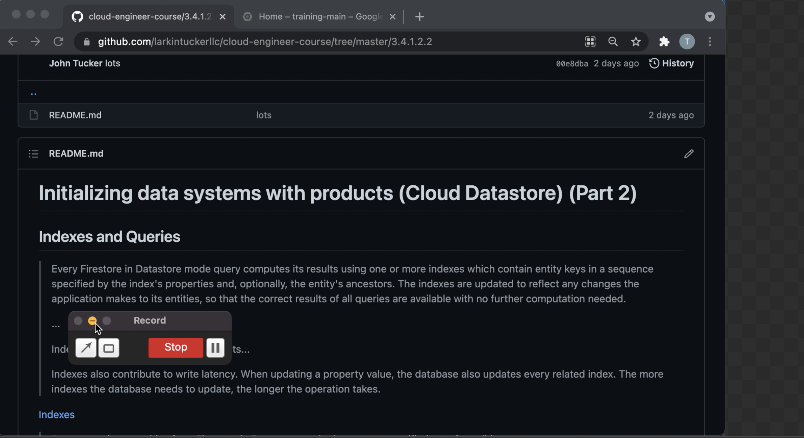

# Initializing data systems with products (Cloud Datastore) (Part 2)

## Indexes and Queries

> Every Firestore in Datastore mode query computes its results using one or more indexes which contain entity keys in a sequence specified by the index's properties and, optionally, the entity's ancestors. The indexes are updated to reflect any changes the application makes to its entities, so that the correct results of all queries are available with no further computation needed.
>
> ...
>
> Indexes contribute to your storage costs...
>
> Indexes also contribute to write latency. When updating a property value, the database also updates every related index. The more indexes the database needs to update, the longer the operation takes.

[Indexes](https://cloud.google.com/datastore/docs/concepts/indexes)

> A query retrieves entities from Firestore in Datastore mode that meet a specified set of conditions.
>
> The query operates on entities of a given kind; it can specify filters on the entities' property values, keys, and ancestors, and can return zero or more entities as results. A query can also specify sort orders to sequence the results by their property values. The results include all entities that have at least one value for every property named in the filters and sort orders, and whose property values meet all the specified filter criteria. The query can return entire entities, projected entities, or just entity keys.

[Datastore Queries](https://cloud.google.com/datastore/docs/concepts/queries)

## Miscellaneous

> Firestore in Datastore mode automatically encrypts all data before it is written to disk. There is no setup or configuration required and no need to modify the way you access the service. The data is automatically and transparently decrypted when read by an authorized user.

[Server-Side Encryption](https://cloud.google.com/datastore/docs/concepts/encryption-at-rest)

> With IAM, every Datastore API method requires that the account making the API request has the appropriate permissions to use the resource. Permissions are granted by setting policies that grant roles to a user, group, or service account. In addition to the basic roles, Owner, Editor, and Viewer, you can grant Firestore in Datastore mode roles to the users of your project.
>
> ...
> roles/datastore.user: Read/write access to data in a Datastore mode database. Intended for application developers and service accounts.

[Identity and Access Management (IAM)](https://cloud.google.com/datastore/docs/access/iam)
