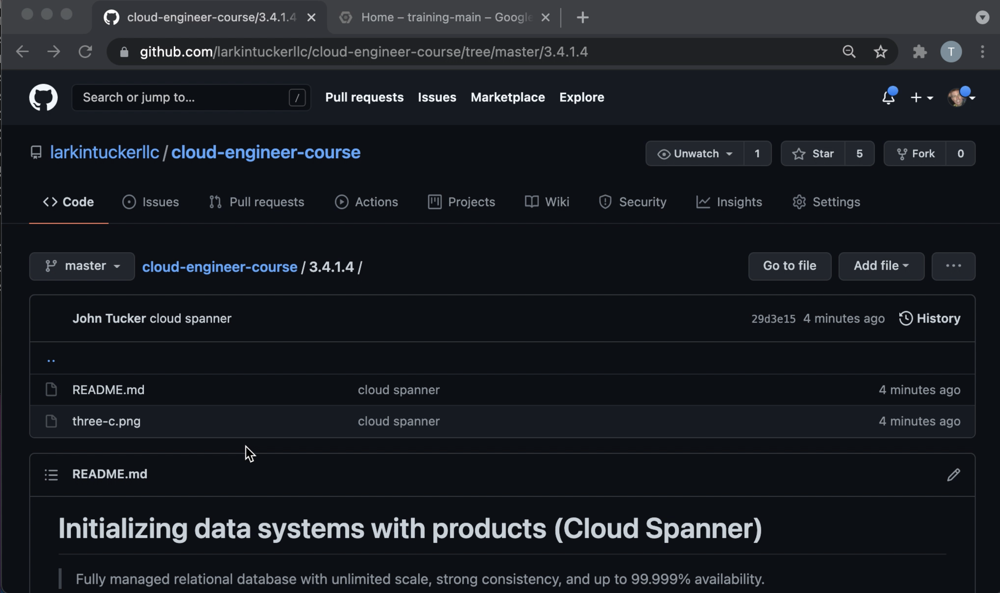
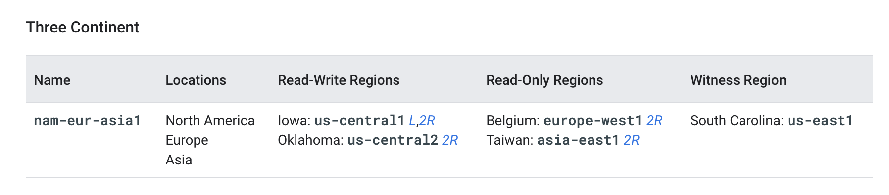

# Initializing data systems with products (Cloud Spanner)

> Fully managed relational database with unlimited scale, strong consistency, and up to 99.999% availability.

[Cloud Spanner](https://cloud.google.com/spanner)

> To use Cloud Spanner, you must first create a Cloud Spanner instance within your Google Cloud project. This instance is an allocation of resources that is used by Cloud Spanner databases created in that instance.
>
> Instance creation includes two important choices: the instance configuration and the node count. These choices determine the location and amount of the instance's serving and storage resources. Your configuration choice is permanent for an instance, but you can change the node count later if needed.
> ...
> An instance configuration defines the geographic placement and replication of the databases in that instance. When you create an instance, you must configure it as either regional (that is, all the resources are contained within a single Google Cloud region) or multi-region (that is, the resources span more than one region).
> ...
> Compute capacity defines amount of server and storage resources that are available to the databases in an instance. When you create an instance, you specify its compute capacity as a number of processing units or as a number of nodes, with 1000 processing units being equal to 1 node.

[Instances](https://cloud.google.com/spanner/docs/instances)

https://cloud.google.com/spanner/docs/quickstart-console

## Sidebar: Cloud Spanner vs. Cloud SQL Pricing

> us-central1 $0.0826 per vCPU (HA)

[Cloud SQL pricing](https://cloud.google.com/sql/pricing)

> us-central1 $0.90
>
> nam-eur-asia1	North America, Europe, and Asia	$9.00

[Cloud Spanner pricing](https://cloud.google.com/spanner/pricing)

Cloud SQL Quickstart (HA): 4 vCPU x $0.0826 = $0.3304

Cloud Spanner Quickstart (Regional): 1 Node x $0.90 = $0.90

## Database and Schema

> A Cloud Spanner database can contain one or more tables. Tables look like relational database tables in that they are structured with rows, columns, and values, and they contain primary keys. Data in Cloud Spanner is strongly typed: you must define a schema for each database and that schema must specify the data types of each column of each table.
> ...
> The primary key uniquely identifies each row in a table. If you want to update or delete existing rows in a table, then the table must have a primary key composed of one or more columns. (A table with no primary key columns can have only one row.) Often your application already has a field that's a natural fit for use as the primary key. For example, in the Customers table example above, there might be an application-supplied CustomerId that serves well as the primary key. In other cases, you may need to generate a primary key when inserting the row, like a unique INT64 value that you generate.
>
> In all cases, you should be careful not to create hotspots with the choice of your primary key. For example, if you insert records with a monotonically increasing integer as the key, you'll always insert at the end of your key space. This is undesirable because Cloud Spanner divides data among servers by key ranges, which means your inserts will be directed at a single server, creating a hotspot. There are techniques that can spread the load across multiple servers and avoid hotspots:

[Schema and data model](https://cloud.google.com/spanner/docs/schema-and-data-model)

https://cloud.google.com/spanner/docs/quickstart-console

## Accessing Data

> Identity and Access Management (IAM) allows you to control user and group access to Cloud Spanner resources at the project, Cloud Spanner instance, and Cloud Spanner database levels. For example, you can specify that a user has full control of a specific database in a specific instance in your project, but cannot create, modify, or delete any instances in your project. Using Cloud Spanner IAM allows you to grant a permission to a user or group without having to modify each Cloud Spanner instance or database permission individually.

[Access control for Cloud Spanner](https://cloud.google.com/spanner/docs/iam)

> Cloud Spanner allows you to determine how current the data should be when you read data by offering two types of reads:
>
> A strong read is a read at a current timestamp and is guaranteed to see all data that has been committed up until the start of this read. Cloud Spanner defaults to using strong reads to serve read requests.
>
> A stale read is read at a timestamp in the past. If your application is latency sensitive but tolerant of stale data, then stale reads can provide performance benefits.

[Reads](https://cloud.google.com/spanner/docs/reads)

> A transaction in Cloud Spanner is a set of reads and writes that execute atomically at a single logical point in time across columns, rows, and tables in a database.

[Transactions](https://cloud.google.com/spanner/docs/transactions)

> Data Manipulation Language (DML) and Mutations are two APIs in Cloud Spanner that you can use to modify data. Each offer similar data manipulation features. 
> ...
> The Data Manipulation Language (DML) in Cloud Spanner allows you to manipulate data in your database tables using INSERT, UPDATE, and DELETE statements. You can run DML statements using the client libraries, the Cloud Console, and gcloud spanner.
> ...
> A mutation represents a sequence of inserts, updates, and deletes that Cloud Spanner applies atomically to different rows and tables in a database. You can include operations that apply to different rows, or different tables, in a mutation. After you define one or more mutations that contain one or more writes, you must apply the mutation to commit the write(s). Each change is applied in the order in which they were added to the mutation.

[Comparing DML and Mutations](https://cloud.google.com/spanner/docs/dml-versus-mutations)

## Miscellanous

> Cloud Spanner Backup and Restore lets you create backups of Cloud Spanner databases on demand, and restore them to provide protection against operator and application errors which result in logical data corruption. Backups are highly available, encrypted, and can be retained for up to a year from the time they are created.

[Backup and Restore](https://cloud.google.com/spanner/docs/backup)
