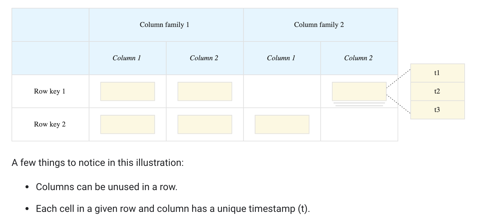
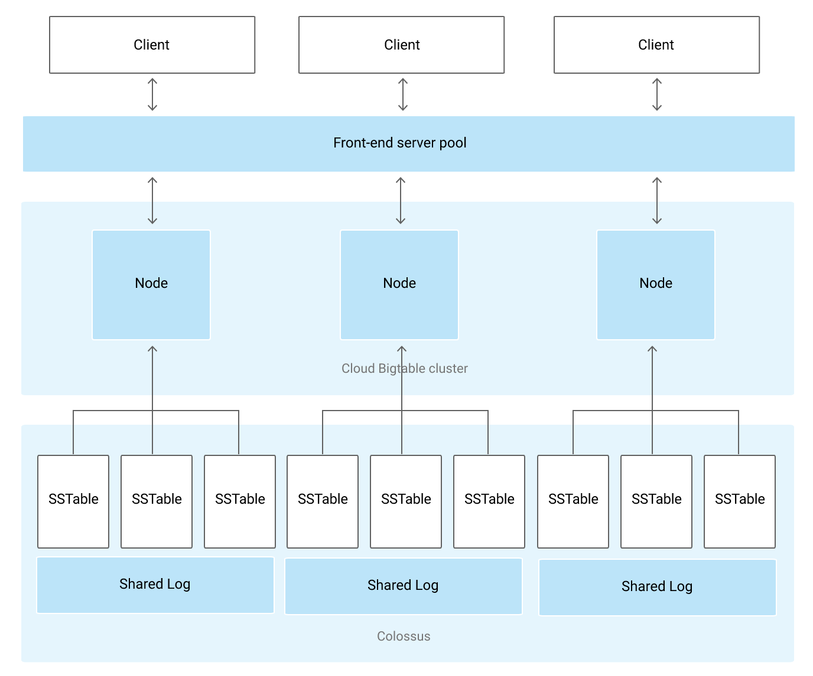

# Initializing data systems with products (Bigtable)

> Cloud Bigtable is a sparsely populated table that can scale to billions of rows and thousands of columns, enabling you to store terabytes or even petabytes of data. A single value in each row is indexed; this value is known as the row key. Bigtable is ideal for storing very large amounts of single-keyed data with very low latency. It supports high read and write throughput at low latency, and it is an ideal data source for MapReduce operations.
>
> Bigtable is exposed to applications through multiple client libraries, including a supported extension to the Apache HBase library for Java. As a result, it integrates with the existing Apache ecosystem of open-source Big Data software.
>
> Bigtable stores data in massively scalable tables, each of which is a sorted key/value map. The table is composed of rows, each of which typically describes a single entity, and columns, which contain individual values for each row. Each row is indexed by a single row key, and columns that are related to one another are typically grouped together into a column family. Each column is identified by a combination of the column family and a column qualifier, which is a unique name within the column family.
>
> Each row/column intersection can contain multiple cells. Each cell contains a unique timestamped version of the data for that row and column. Storing multiple cells in a column provides a record of how the stored data for that row and column has changed over time. Bigtable tables are sparse; if a column is not used in a particular row, it does not take up any space.

[Overview of Bigtable](https://cloud.google.com/bigtable/docs/overview)

https://cloud.google.com/bigtable/docs/quickstart-cbt
