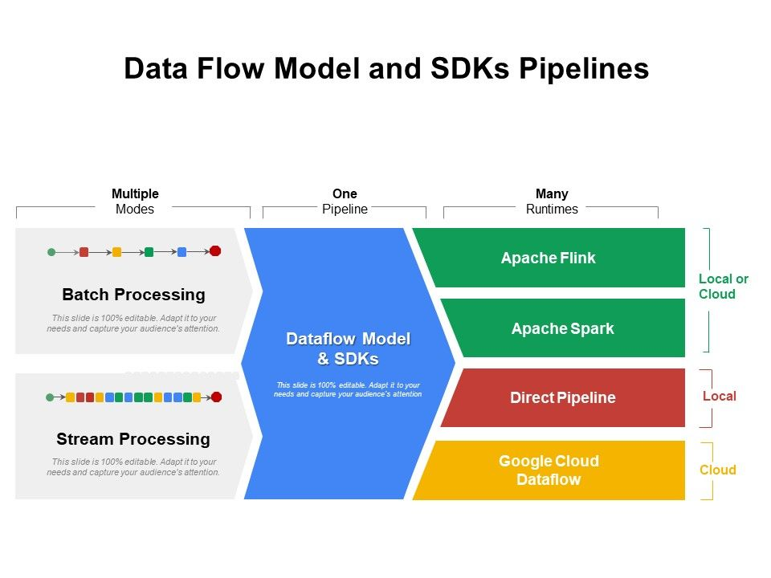

# Initializing data systems with products (Cloud Dataflow)

> Unified stream and batch data processing that's serverless, fast, and cost-effective.

[Dataflow](https://cloud.google.com/dataflow)

> Apache Beam is a unified model for defining both batch and streaming data-parallel processing pipelines.

[Basics of the Beam model](https://beam.apache.org/documentation/basics/)

[Data Flow Model And SDKs Pipelines](https://www.slideteam.net/data-flow-model-and-sdks-pipelines.html)

> Dataflow jobs are billed per second, based on the actual use of Dataflow batch or streaming workers. Additional resources, such as Cloud Storage or Pub/Sub, are each billed per that service’s pricing.

[Dataflow](https://cloud.google.com/dataflow)

## Pricing

> A Dataflow Processing Unit (DPU) is a Dataflow usage metering unit that tracks the amount of resources consumed by your jobs. DPUs track usage of various resources including compute, memory, disk storage, data shuffled (in case of batch jobs) and streaming data processed (in case of streaming jobs). Jobs that consume more resources will see more DPU usage compared to jobs that consume fewer resources. While there is no one-to-one mapping between the various resources your job consumes and DPU, 1 DPU is comparable to the resources used by a Dataflow job that runs for one hour on a 1 vCPU 4 GB worker with a 250 GB Persistent Disk.

> You are billed by the second for the total number of DPUs consumed by your job during a given hour. The price of a single DPU varies based on the job type— batch or streaming.

> Batch: $0.071 / per DPU per hour

> Streaming: $0.082 / per DPU per hour

[Dataflow pricing](https://cloud.google.com/dataflow/pricing)

## Apache Beam Python SDK Quickstart (Direct)

The first bit of trickiness here is getting Python installed and configured; here I chose to use [pyenv](https://github.com/pyenv/pyenv) and [pyenv-virtualenv](https://github.com/pyenv/pyenv-virtualenv).

[Apache Beam Python SDK Quickstart](https://beam.apache.org/get-started/quickstart-py/)

## Apache Beam Python SDK Quickstart (Dataflow)

[Cloud Dataflow Runner prerequisites and setup](https://beam.apache.org/documentation/runners/dataflow/#setup)

[Apache Beam Python SDK Quickstart](https://beam.apache.org/get-started/quickstart-py/)
