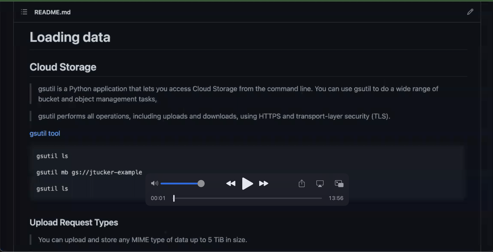

# Loading data

[](https://youtu.be/QOOxr7RIEco)

## Cloud Storage

> gsutil is a Python application that lets you access Cloud Storage from the command line. You can use gsutil to do a wide range of bucket and object management tasks,

> gsutil performs all operations, including uploads and downloads, using HTTPS and transport-layer security (TLS).

[gsutil tool](https://cloud.google.com/storage/docs/gsutil)

```
gsutil ls

gsutil mb gs://jtucker-example

gsutil ls
```

### Upload Request Types

> You can upload and store any MIME type of data up to 5 TiB in size.

> Single-request upload. Use this if the file is small enough to upload in its entirety if the connection fails.

> Resumable upload. Use this for a more reliable transfer, which is especially important with large files. Resumable uploads are a good choice for most applications, since they also work for small files at the cost of one additional HTTP request per upload. You can also use resumable uploads to perform streaming transfers, which allows you to upload an object of unknown size.

[Uploads and downloads](https://cloud.google.com/storage/docs/uploads-downloads)

```
gsutil cp ~/Desktop/kitten.png gs://jtucker-example/

gsutil ls gs://jtucker-example/
```

> XML API multipart upload. An upload method that is compatible with Amazon S3 multipart uploads. Files are uploaded in parts and assembled into a single object with the final request. XML API multipart uploads allow you to upload the parts in parallel, potentially reducing the time to complete the overall upload.

### Upload Strategies

> Cloud Storage supports streaming transfers, which allow you to stream data to and from your Cloud Storage account without requiring that the data first be saved to a file.

> Streaming uploads are useful when you want to upload data whose final size you don't know at the start of the upload, such as when generating the upload data from a process, or when compressing an object on-the-fly.

[Streaming transfers](https://cloud.google.com/storage/docs/streaming)

```
echo 'hello world!' | gsutil cp - gs://jtucker-example/hello.txt

gsutil ls gs://jtucker-example/

gsutil cp gs://jtucker-example/hello.txt - | less
```

> One strategy for uploading large files is called parallel composite uploads. In such an upload, a file is divided into up to 32 chunks, the chunks are uploaded in parallel to temporary objects, the final object is recreated using the temporary objects, and the temporary objects are deleted.

> Parallel composite uploads can be significantly faster if network and disk speed are not limiting factors; however, the final object stored in your bucket is a composite object, which only has a crc32c hash and not an MD5 hash. 

[Uploads and downloads](https://cloud.google.com/storage/docs/uploads-downloads)

```
gsutil cp ~/Desktop/video.mp4 gs://jtucker-example/

gsutil -o 'GSUtil:parallel_composite_upload_threshold=1M' cp ~/Desktop/video.mp4 gs://jtucker-example/
```

### Downloads

> All downloads from Cloud Storage have the same basic behavior: an HTTP or HTTPS GET request that can include an optional Range header, which defines a specific portion of the object to download.

> Using this basic download behavior, you can resume interrupted downloads, and you can utilize more advanced download strategies, such as sliced object downloads and streaming downloads.

[Uploads and downloads](https://cloud.google.com/storage/docs/uploads-downloads)

> gsutil uses HTTP Range GET requests to perform "sliced" downloads in parallel when downloading large objects from Cloud Storage. 

[cp - Copy files and objects](https://cloud.google.com/storage/docs/gsutil/commands/cp#sliced-object-downloads)

```
gsutil cp gs://jtucker-example/video.mp4 .
```
