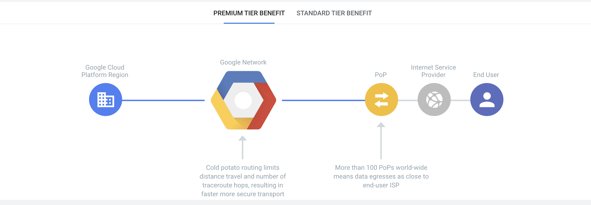
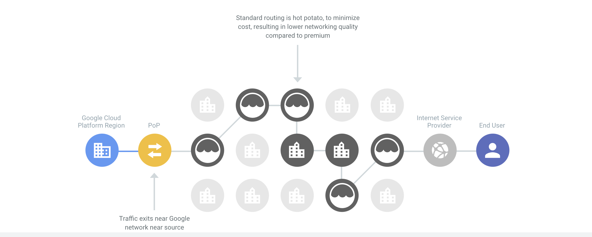

# Launching a Compute Engine instance with custom network configuration (e.g., internal-only IP address, Google private access, static external and private IP address, network tags)

# Internal-Only IP Address

> Every VM instance can have one primary internal IP address that is unique to the VPC network. You can assign a specific internal IP address when you create a VM instance, or you can reserve a static internal IP address for your project and assign that address to your resources. If you don't specify an address, Compute Engine assigns one automatically. In either case, the address must belong to the IP range of the subnet.

> You can assign an external IP address to an instance or a forwarding rule if you need to communicate with the internet, with resources in another network, or with a resource outside of Compute Engine. Sources from outside a Google Cloud VPC network can address a specific resource by the external IP address, as long as firewall rules allows the connection. Only resources with an external IP address can send and receive traffic directly to and from outside the network.

[IP addresses](https://cloud.google.com/compute/docs/ip-addresses)

# Google Private Access

> VM instances that only have internal IP addresses (no external IP addresses) can use Private Google Access. They can reach the external IP addresses of Google APIs and services. The source IP address of the packet can be the primary internal IP address of the network interface or an address in an alias IP range that is assigned to the interface. If you disable Private Google Access, the VM instances can no longer reach Google APIs and services; they can only send traffic within the VPC network.

[Private Google Access](https://cloud.google.com/vpc/docs/private-google-access)

> By default, when a Compute Engine VM lacks an external IP address assigned to its network interface, it can only send packets to other internal IP address destinations. You can allow these VMs to connect to the set of external IP addresses used by Google APIs and services by enabling Private Google Access on the subnet used by the VM's network interface.

> If your VPC network contains a default route whose next hop is the default internet gateway, you can use that route to access Google APIs and services on any domain, without needing to create custom routes. See routing with a default route for details.

[Configuring Private Google Access](https://cloud.google.com/vpc/docs/configure-private-google-access)

# Cloud NAT

> Cloud NAT is a distributed, software-defined managed service. It's not based on proxy VMs or appliances. Cloud NAT configures the Andromeda software that powers your Virtual Private Cloud (VPC) network so that it provides source network address translation (source NAT or SNAT) for VMs without external IP addresses. 

> Cloud NAT relies on custom static routes whose next hops are the default internet gateway. To fully utilize a Cloud NAT gateway, your VPC network needs a default route whose next hop is the default internet gateway. For more information, see routes interactions.

[Cloud NAT overview](https://cloud.google.com/nat/docs/overview)

> Cloud NAT uses NAT gateway to manage those connections. A NAT gateway is region and VPC network specific. If you have VM instances in multiple regions, you’ll need to create a NAT gateway for each region

Cloud Console

> Cloud Router is a fully distributed and managed Google Cloud service that uses the Border Gateway Protocol (BGP) to advertise IP address ranges. It programs custom dynamic routes based on the BGP advertisements that it receives from a peer. Instead of a physical device or appliance, each Cloud Router is implemented by software tasks that act as BGP speakers and responders. A Cloud Router also serves as the control plane for Cloud NAT. Cloud Router provides BGP services for the following Google Cloud products:

[Cloud Router overview](https://cloud.google.com/network-connectivity/docs/router/concepts/overview)

# Private (Internal) Static IP Address

> If a virtual machine (VM) instance requires a fixed internal IP address that does not change, you can obtain a static internal IP address for that VM using one of the following options:

> Reserve a new static internal IP address and then assign the address when creating the VM.

> Promote an existing ephemeral internal IP address to become a static internal IP address.

[Reserving a static internal IP address](https://cloud.google.com/compute/docs/ip-addresses/reserve-static-internal-ip-address)

# Public (External) Static IP Address

> If a virtual machine (VM) instance requires a fixed external IP address that does not change, you can obtain a static external IP address for that instance by using one of the following options:

> Reserve a new static external IP address and then assign the address to a new VM instance.

> Promote an existing ephemeral external IP address to become a static external IP address.

[Reserving a static external IP address](https://cloud.google.com/compute/docs/ip-addresses/reserve-static-external-ip-address)
