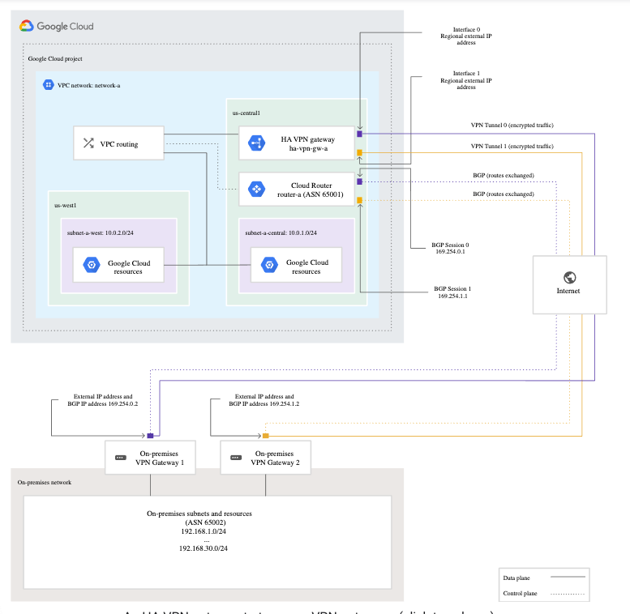

# Creating a VPN between a Google VPC and an external network using Cloud VPN

No video

> Cloud VPN securely connects your peer network to your Virtual Private Cloud (VPC) network through an IPsec VPN connection. Traffic traveling between the two networks is encrypted by one VPN gateway and then decrypted by the other VPN gateway. This action protects your data as it travels over the internet. You can also connect two instances of Cloud VPN to each other.

> Google Cloud offers two types of Cloud VPN gateways: HA VPN and Classic VPN. However, certain Classic VPN functionality is being deprecated on March 31, 2022. For more information, see Classic VPN partial deprecation.

> HA VPN is a high-availability (HA) Cloud VPN solution that lets you securely connect your on-premises network to your VPC network through an IPsec VPN connection in a single region. HA VPN provides an SLA of 99.99% service availability.

> When you create an HA VPN gateway, Google Cloud automatically chooses two external IP addresses, one for each of its fixed number of two interfaces.

> Each Cloud VPN tunnel can support up to 3 gigabits per second (Gbps) for the sum of ingress and egress traffic.

> VPN tunnels connected to HA VPN gateways must use dynamic (BGP) routing. Depending on the way that you configure route priorities for HA VPN tunnels, you can create an active/active or active/passive routing configuration. For both of these routing configurations, both VPN tunnels remain active.

> When using a single HA VPN gateway, we recommend using an active/passive routing configuration. With this configuration, the observed bandwidth capacity at the time of normal tunnel operation matches the bandwidth capacity observed during failover. This type of configuration is easier to manage because the observed bandwidth limit stays constant, except for the multiple gateway scenario described previously.

> When using multiple HA VPN gateways, we recommend using an active/active routing configuration. With this configuration, the observed bandwidth capacity at the time of normal tunnel operation is twice that of the guaranteed bandwidth capacity. However, this configuration effectively underprovisions the tunnels and can cause dropped traffic in case of failover.

[Cloud VPN Overview](https://cloud.google.com/network-connectivity/docs/vpn/concepts/overview)
