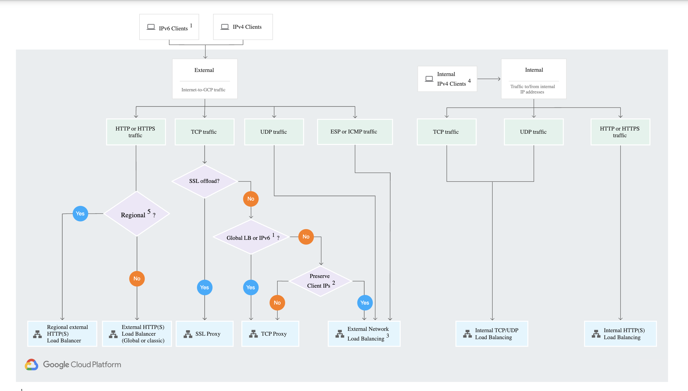
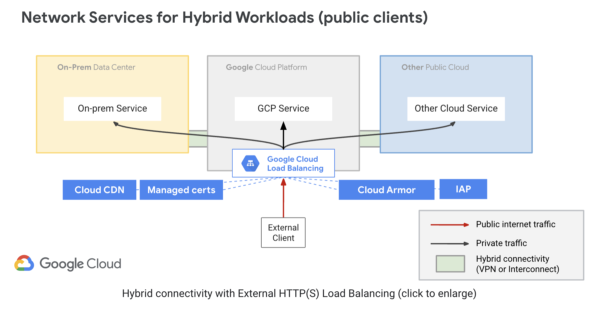
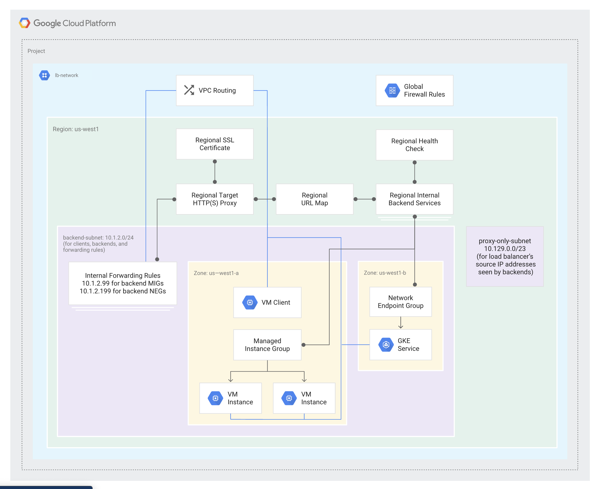

# Creating a load balancer to distribute application network traffic to an application (e.g., Global HTTP(S) load balancer, Global SSL Proxy load balancer, Global TCP Proxy load balancer, regional network load balancer, regional internal load balancer) (Part 1)

[Video](https://youtu.be/W_wcwag5MM8)

> Cloud Load Balancing is a fully distributed, software-defined managed service. It isn't hardware-based, so you don't need to manage a physical load balancing infrastructure.

> Cloud Load Balancing is built on the same frontend-serving infrastructure that powers Google. It supports 1 million+ queries per second with consistent high performance and low latency. Traffic enters Cloud Load Balancing through 80+ distinct global load balancing locations, maximizing the distance traveled on Google's fast private network backbone. By using Cloud Load Balancing, you can serve content as close as possible to your users.

> Use Layer 4-based load balancing to direct traffic based on data from network and transport layer protocols such as TCP, UDP, ESP, or ICMP. Use Layer 7-based load balancing to add request routing decisions based on attributes, such as the HTTP header and the uniform resource identifier.

[Cloud Load Balancing overview](https://cloud.google.com/load-balancing/docs/load-balancing-overview)

## Internal HTTP(S) Load Balancer

> Google Cloud Internal HTTP(S) Load Balancing is a proxy-based, regional Layer 7 load balancer that enables you to run and scale your services behind an internal IP address.

> Internal HTTP(S) Load Balancing distributes HTTP and HTTPS traffic to backends hosted on Compute Engine and Google Kubernetes Engine (GKE). The load balancer is accessible only in the chosen region of your Virtual Private Cloud (VPC) network on an internal IP address.

> Backends can be instance groups or NEGs in any of the following configurations:

> Managed instance groups (zonal or regional)

> Unmanaged instance groups (zonal)

> Network endpoint groups (zonal)

> You cannot use instance groups and NEGs on the same backend service.

[Internal HTTP(S) Load Balancing overview](https://cloud.google.com/load-balancing/docs/l7-internal)

DO: Example of Creating Regional Managed Instance Group with 

https://github.com/larkintuckerllc/cloud-engineer-course/tree/master/3.1.2

* NAT

* Instance Template
  * Management > Startup Script
  * Networking > Network tags; "backend"
  * Networking > External IP: None

* Managed Instance Group
  * Location: Multiple-zones
  * Instance template: Above
  * Min. Instances: 2

> In the diagram above, the proxy-only subnet provides a set of IP addresses that Google uses to run Envoy proxies on your behalf. You must create a proxy-only subnet in each region of a VPC network where you use internal HTTP(S) load balancers. All your internal HTTP(S) load balancers in a region and VPC network share the same proxy-only subnet because all internal HTTP(S) load balancers in the region and VPC network share a pool of Envoy proxies.

[Internal HTTP(S) Load Balancing overview](https://cloud.google.com/load-balancing/docs/l7-internal)

DO: CREATE /23 PROXY-ONLY SUBNET

* Name: proxy-only-subnet
* Region: us-central1
* Purpose: Internal HTTP(S) Load Balancing
* IP 10.0.0.0/23

DO: CREATE FIREWALL RULES

* fw-allow-health-check. An ingress rule, applicable to the instances being load balanced, that allows all TCP traffic from the Google Cloud health checking systems (in 130.211.0.0/22 and 35.191.0.0/16). This example uses the target tag backend.
* fw-allow-proxies. An ingress rule, applicable to the instances being load balanced, that allows TCP traffic on ports 80, 443, and 8080 from the internal HTTP(S) load balancer's managed proxies. This example uses the target tag backend.

DO: CREATE HEALTH CHECK

* name: l7-ilb-basic-check
* scope: Regional

> An internal managed forwarding rule specifies an internal IP address, port, and regional target HTTP(S) proxy. Clients use the IP address and port to connect to the load balancer's Envoy proxies – the forwarding rule's IP address is the IP address of the load balancer (sometimes called a virtual IP address or VIP).

[Internal HTTP(S) Load Balancing overview](https://cloud.google.com/load-balancing/docs/l7-internal)

DO: CREATE LOAD BALANCER

* name: l7-ilb-map
* region: us-central1
* backend service
  * name: l7-ilb-backend-service
  * instance group: above
  * port number: 80
  * health check: above
* routing rule (simple)
* frontend configuration
  * l7-ilb-forwarding-rule
  * subnet: default

DO: VALIDATE BY CREATING INSTANCE AND CURLING VIP
