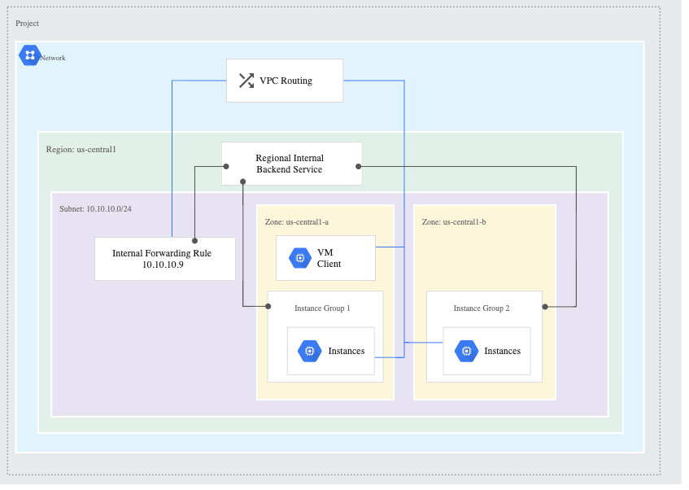

# Creating a load balancer to distribute application network traffic to an application (e.g., Global HTTP(S) load balancer, Global SSL Proxy load balancer, Global TCP Proxy load balancer, regional network load balancer, regional internal load balancer) (Part 2)

[Video](https://youtu.be/w3hB0hyQPyA)

> Google Cloud Internal TCP/UDP Load Balancing is a regional load balancer that is built on the Andromeda network virtualization stack.

> Internal TCP/UDP Load Balancing distributes traffic among internal virtual machine (VM) instances in the same region in a Virtual Private Cloud (VPC) network. It enables you to run and scale your services behind an internal IP address that is accessible only to systems in the same VPC network or systems connected to your VPC network.

[Internal TCP/UDP Load Balancing overview](https://cloud.google.com/load-balancing/docs/internal)

> Google Cloud external TCP/UDP Network Load Balancing (after this referred to as Network Load Balancing) is a regional, pass-through load balancer. A network load balancer distributes external traffic among virtual machine (VM) instances in the same region.

[External TCP/UDP Network Load Balancing overview](https://cloud.google.com/load-balancing/docs/network)

> SSL Proxy Load Balancing is a reverse proxy load balancer that distributes SSL traffic coming from the internet to virtual machine (VM) instances in your Google Cloud VPC network.

> When using SSL Proxy Load Balancing for your SSL traffic, user SSL (TLS) connections are terminated at the load balancing layer, and then proxied to the closest available backend instances by using either SSL (recommended) or TCP. For the types of backends that are supported, see Backends.

[SSL Proxy Load Balancing overview](https://cloud.google.com/load-balancing/docs/ssl)

> TCP Proxy Load Balancing is a reverse proxy load balancer that distributes TCP traffic coming from the internet to virtual machine (VM) instances in your Google Cloud VPC network. When using TCP Proxy Load Balancing, traffic coming over a TCP connection is terminated at the load balancing layer, and then forwarded to the closest available backend using TCP or SSL.

> TCP Proxy Load Balancing lets you use a single IP address for all users worldwide. The TCP proxy load balancer automatically routes traffic to the backends that are closest to the user.

[TCP Proxy Load Balancing overview](https://cloud.google.com/load-balancing/docs/tcp)

## Internal TCP/UDP Load Balancing

**note**: Because we are using internal IP addresses, we require a NAT in the region.



Notice that we do not need Firewall rules as *default-allow-internal* allows traffic as no proxy; but need Firewall rules for Health Check.

DO: CREATE FIREWALL RULES

* fw-allow-health-check. An ingress rule, applicable to the instances being load balanced, that allows all TCP traffic from the Google Cloud health checking systems (in 130.211.0.0/22 and 35.191.0.0/16). This example uses the target tag backend.

DO: Create Managed Instance Group with internal IP address and startup script.

```
#! /bin/bash
apt update
apt -y install apache2
cat <<EOF > /var/www/html/index.html
<html><body><h1>Hello World</h1>
<p>This page was created from a startup script.</p>
</body></html>
EOF
apt -y install unbound
cat <<EOF >> /etc/unbound/unbound.conf
interface-automatic: yes
access-control: 10.128.0.0/9 allow
EOF
systemctl restart unbound
```

**note**: Important sidebar on troubleshooting.

> When you start a virtual machine (VM) instance using Google-provided public images, a guest environment is automatically installed on the VM instance. The guest environment is a set of scripts, daemons, and binaries that read the content of the metadata server to make a VM run properly on Compute Engine. A metadata server is a communication channel for transferring information from a client to the guest operating system.

[Guest environment](https://cloud.google.com/compute/docs/images/guest-environment)

> For VMs created from Google Cloud images, the Guest agent installs the local route for the load balancer's IP address. Google Kubernetes Engine instances based on Container-Optimized OS implement this by using iptables instead.

> On a Linux backend VM, you can verify the presence of the local route by running the following command. Replace LOAD_BALANCER_IP with the load balancer's IP address:

> sudo ip route list table local | grep LOAD_BALANCER_IP

> Packets sent to an internal TCP/UDP load balancer arrive at backend VMs with the destination IP address of the load balancer itself. This type of load balancer is not a proxy, and this is expected behavior.

[Troubleshooting Internal TCP/UDP Load Balancing](https://cloud.google.com/load-balancing/docs/internal/troubleshooting-ilb)

DO: CREATE HEALTH CHECK

* name: l4-ilb-basic-check
* scope: Regional

DO: CREATE LOAD BALANCER

* name: l4-ilb-map
* region: us-central1
* backend service
  * name: l4-ilb-backend-service
  * instance group: above
  * health check: above
* frontend configuration
  * l4-ilb-forwarding-rule
  * subnet: default
  * port: 53

DO: VALIDATE BY CREATING INSTANCE AND DIGGING
