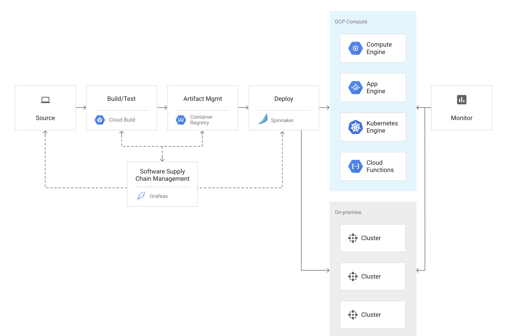

# Continuous delivery



# Container Registry

> Container Registry is a single place for your team to manage Docker images, perform vulnerability analysis, and decide who can access what with fine-grained access control. Existing CI/CD integrations let you set up fully automated Docker pipelines to get fast feedback.

[Container Registry](https://cloud.google.com/container-registry)

https://codeburst.io/source-to-image-s2i-by-example-9635c80b6108

https://cloud.google.com/container-registry/docs/quickstart

```
$ gcloud auth configure-docker
$ docker build . -t gcr.io/magnetic-lore-329211/hello-world:0.1.0
$ docker push gcr.io/magnetic-lore-329211/hello-world:0.1.0
```

# Artifact Registry

> As the evolution of Container Registry, Artifact Registry is a single place for your organization to manage container images and language packages (such as Maven and npm). It is fully integrated with Google Cloud’s tooling and runtimes and comes with support for native artifact protocols. This makes it simple to integrate it with your CI/CD tooling to set up automated pipelines.

[Artifact Registry](https://cloud.google.com/artifact-registry)

https://cloud.google.com/artifact-registry/docs/docker/quickstart

```
$ gcloud auth configure-docker us-central1-docker.pkg.dev
$ docker tag  7891a74397a4 \
us-central1-docker.pkg.dev/magnetic-lore-329211/my-repo/hello-world:0.1.0
$ docker push us-central1-docker.pkg.dev/magnetic-lore-329211/my-repo/hello-world:0.1.0
```

# Cloud Build

> Cloud Build is a service that executes your builds on Google Cloud Platform's infrastructure.

> Cloud Build can import source code from a variety of repositories or cloud storage spaces, execute a build to your specifications, and produce artifacts such as Docker containers or Java archives.

> You can write a build config to provide instructions to Cloud Build on what tasks to perform. You can configure builds to fetch dependencies, run unit tests, static analyses, and integration tests, and create artifacts with build tools such as docker, gradle, maven, bazel, and gulp.

> Cloud Build executes your build as a series of build steps, where each build step is run in a Docker container. Executing build steps is analogous to executing commands in a script.

> You can either use the build steps provided by Cloud Build and the Cloud Build community, or write your own custom build steps:

> You can manually start builds in Cloud Build using the gcloud command-line tool or the Cloud Build API, or use Cloud Build's build triggers feature to create an automated continuous integration/continuous delivery (CI/CD) workflow that starts new builds in response to code changes.

> You can integrate build triggers with many code repositories, including Cloud Source Repositories, GitHub, and Bitbucket.

[Overview of Cloud Build](https://cloud.google.com/build/docs/overview)

# Manually Start Build

https://cloud.google.com/build/docs/running-builds/start-build-command-line-api

> compresses your application code, Dockerfile, and any other assets in the current directory as indicated by .;

> uploads the files to a Cloud Storage bucket;

> initiates a build using the uploaded files as input;

> tags the image using the provided name

> pushes the built image to Container Registry.

```
gcloud builds submit --tag gcr.io/magnetic-lore-329211/hello-world:0.1.0 .
```

```
gcloud builds submit --tag \
us-central1-docker.pkg.dev/magnetic-lore-329211/my-repo/hello-world:0.1.0 .
```

# Cloud Source Repositories

TODO

# Starting Builds with Build Tirggers

TODO

# Deploy

TODO
