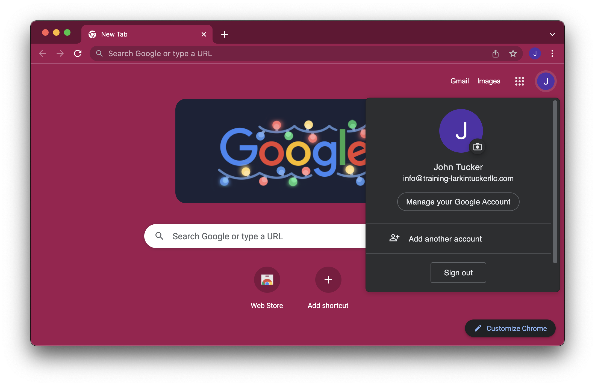
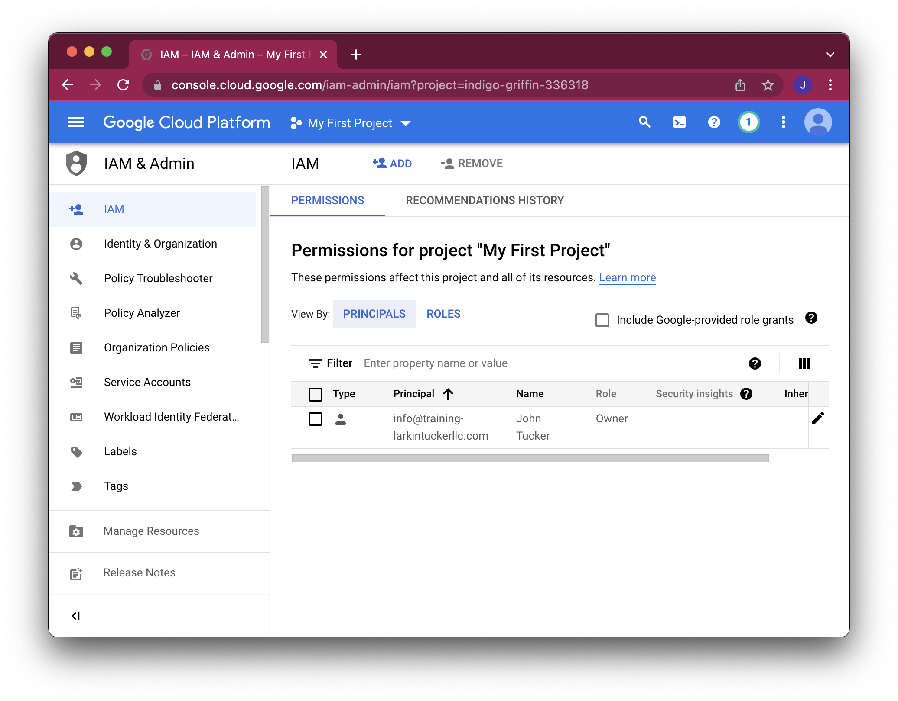

# Managing users in Cloud Identity (manually and automated) (Part 1)

In order to follow along, one will need to start with a new DNS domain, e.g., created through GoDaddy. One will also need to create an email address through the DNS domain provider so that one can create a Google account with that email address.

We then create a new GCP Project and Billing Account using this Google account. One interesting thing here is that both of these resources are associated with the Google account, i.e., without some solution one could imagine an organization accumulating a mess of Projects and Billing Accounts.

