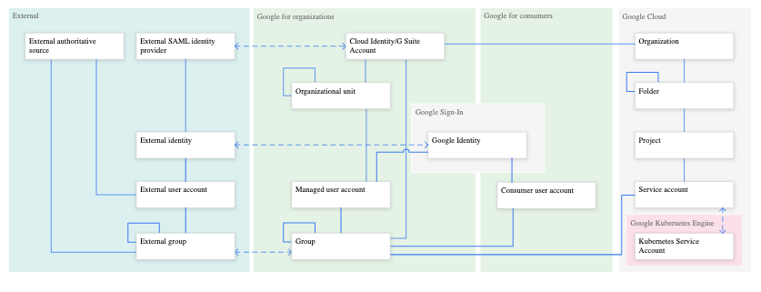

# Managing users in Cloud Identity (manually and automated)

Mostly theoretical; except the wizard which is self-explanitory. No video.

## Resource Hiearchy

> The purpose of the Google Cloud resource hierarchy is two-fold:

> Provide a hierarchy of ownership, which binds the lifecycle of a resource to its immediate parent in the hierarchy.

> Provide attach points and inheritance for access control and organization policies.

> Google Workspace and Cloud Identity customers have access to additional features of the Google Cloud resource hierarchy that provide benefits such as centralized visibility and control, and further grouping mechanisms, such as folders.

> When a user with a Google Workspace or Cloud Identity account creates a Google Cloud Project, an Organization resource is automatically provisioned for them.

> A Google Workspace or Cloud Identity account can have exactly one Organization provisioned with it. Once an Organization resource is created for a domain, all Google Cloud projects created by members of the account domain will by default belong to the Organization resource. When a managed user creates a project, the requirement is that it must be in some organization. If a user specifies an organization and they have the right permissions, the project is assigned to that organization. Otherwise, it will default to the organization the user is associated with. It is impossible to create a project that isn't associated with an organization.

> The Google Workspace super admin is the individual responsible for domain ownership verification and the contact in cases of recovery. For this reason, the Google Workspace super admin is granted the ability to assign IAM roles by default. The Google Workspace super admin’s main duty with respect to Google Cloud is to assign the Organization Administrator IAM role to appropriate users in their domain.

> With an Organization resource, projects belong to your organization instead of the employee who created the project. This means that the projects are no longer deleted when an employee leaves the company; instead they will follow the organization’s lifecycle on Google Cloud.

> Furthermore, organization administrators have central control of all resources. They can view and manage all of your company's projects. This enforcement means that there can no longer be shadow projects or rogue admins.

> Also, you can grant roles at the organization level, which are inherited by all projects and folders under the Organization resource. For example, you can grant the Network Admin role to your networking team at the organization level, allowing them to manage all the networks in all projects in your company, instead of granting them the role for all individual projects.

> The effective policy for a resource is the union of the policy set on the resource and the policy inherited from its ancestors. This inheritance is transitive. In other words, resources inherit policies from the project, which inherit policies from the organization. Therefore, the organization-level policies also apply at the resource level.

[Resource hierarchy](https://cloud.google.com/resource-manager/docs/cloud-platform-resource-hierarchy)

## Organization Policy

> The Organization Policy Service gives you centralized and programmatic control over your organization's cloud resources. As the organization policy administrator, you will be able to configure constraints across your entire resource hierarchy.

> An organization policy is a configuration of restrictions. You, as the organization policy administrator, define an organization policy, and you set that organization policy on organizations, folders, and projects in order to enforce the restrictions on that resource and its descendants.

> In order to define an organization policy, you choose a constraint, which is a particular type of restriction against either a Google Cloud service or a group of Google Cloud services. You configure that constraint with your desired restrictions.

> Descendants of the targeted resource hierarchy node inherit the organization policy. By applying an organization policy to the root organization node, you are able to effectively drive enforcement of that organization policy and configuration of restrictions across your organization.

> A constraint has a type, either list or boolean. List constraints evaluate the constraint with a list of allowed or denied values that you provide, such as an allowlist of IP addresses that can connect to a virtual machine. Boolean constraints are either enforced or not enforced for a given resource, and govern a specific behavior, such as whether external service accounts can be created.

[Introduction to the Organization Policy Service](https://cloud.google.com/resource-manager/docs/organization-policy/overview)

## Google Workspace or Cloud Identity

In order to follow along, one will need to start with a new DNS domain, e.g., created through GoDaddy. Also, helpful if one has setup an email account with DNS provider.

> How teams of all sizes connect, create, and collaborate. A flexible, innovative solution for people and organizations to achieve more.

[Google Workspace](https://workspace.google.com/)

> User lifecycle management, directory services, account security, single sign-on, device management and more in one simple integrated solution

[Cloud Identity](https://workspace.google.com/signup/gcpidentity/welcome)

Will automatically, kick one into a checklist wizard in Cloud Console, IAM & Admin > Identity & Organization. 

**note:** Run into an initial quota problem with number of projects with billing enabled (seems to be 5).  Continued with only the "nonprod" Projects where billing is required, i.e., setting up networking.

